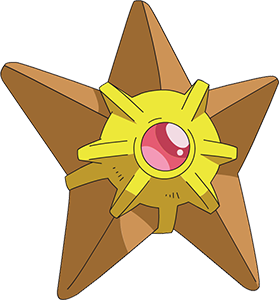

<h1 align="center">Päähahmojen pokemonit</h1>

</fieldset>
  <legend><b>Päähahmot</b></legend>
<h2>Ash</h2> 

Ashin Pokemon ja paras kaveri on Pikachu, kaikissa pokemon sarjoissa Pikachu on Ashin Pääpokemoni.

<h2>Misty</h2>

Mistyllä on salijohtaja jolla ollut sarjassa enemmän kuin yksi Pääpokemoni, mutta Staryu on ollut niistä merkittävin.
  
<h2>Brock</h2>

Brock on salijohtaja, joka yleisesti käytti Pokemoneja Onix ja Geodude.
  
<h2>Jessie ja James</h2>

Jessiellä ja Jamesilla usein antoivat heidän Pokemonit pois Rocket Leaguen johtajalle, mutta Jessien ensimmäinen Pokemon oli Ekans, ja Jamesin ensimmäinen pokemon oli Carnivine.
 </fieldset>

</fieldset>
  <legend></b>Heidän Pokemonit</b></legend>
<h2>Pikachu</h2>

<h2>Staryu</h2>

<h2>Onix ja Geodude</h2>

<h2>Ekans</h2>

<h2>Carnivine</h2>

</fieldset>

